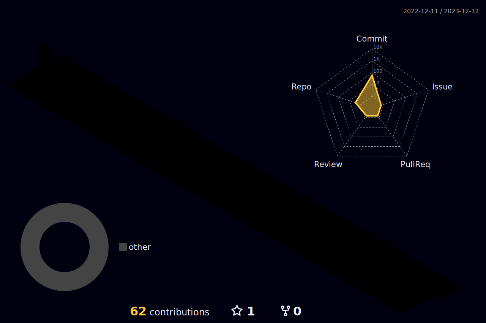

### Hi there 👋 I am Plommon 🐱

- 🔭 I’m currently working on Solidity security and programming languages.
- 🌱 I’m currently learning reinforcing learning and linux kernal.
- 😄 Pronouns: He/Him

  

  

